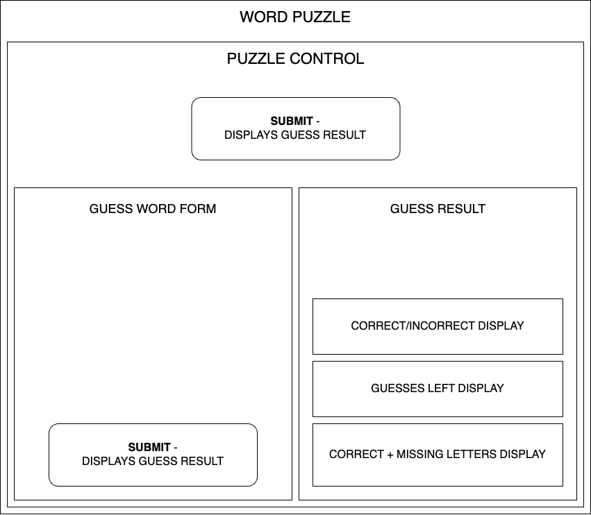

# Guess That Cheese

### by Emma Gerigscott

<!--  -->

## Description

**Guess that Cheese** is a word guessing game. Guess a letter and see if it's in the cheese name. If not, you loose a guess. Be careful, you only get 6 guesses to get the right cheese!

## Technologies
* _React_
* _JSX_
* _vite_
* _Node.js_
* _Javascript_

## Component Diagram


## Setup Instructions
1. Clone this repo to your desktop
2. Open your terminal (e.g. Terminal of Gitbash) and navigate to this project's directory, "word-puzzle".
3. Run ```npm install``` in the project's root directory to install necessary dependencies.
4. Run ```npm start``` in the project's root directory to start the app in your browser 

## Known Bugs 
* _Prints "wrong" at game start before even guessing_
* _Can't tell when you actually win the game_

# License

MIT License

Copyright (c) 2023 Emma Gerigscott

Permission is hereby granted, free of charge, to any person obtaining a copy of this software and associated documentation files (the "Software"), to deal in the Software without restriction, including without limitation the rights to use, copy, modify, merge, publish, distribute, sublicense, and/or sell copies of the Software, and to permit persons to whom the Software is furnished to do so, subject to the following conditions:

The above copyright notice and this permission notice shall be included in all copies or substantial portions of the Software.

THE SOFTWARE IS PROVIDED "AS IS", WITHOUT WARRANTY OF ANY KIND, EXPRESS OR IMPLIED, INCLUDING BUT NOT LIMITED TO THE WARRANTIES OF MERCHANTABILITY, FITNESS FOR A PARTICULAR PURPOSE AND NONINFRINGEMENT. IN NO EVENT SHALL THE AUTHORS OR COPYRIGHT HOLDERS BE LIABLE FOR ANY CLAIM, DAMAGES OR OTHER LIABILITY, WHETHER IN AN ACTION OF CONTRACT, TORT OR OTHERWISE, ARISING FROM, OUT OF OR IN CONNECTION WITH THE SOFTWARE OR THE USE OR OTHER DEALINGS IN THE SOFTWARE.